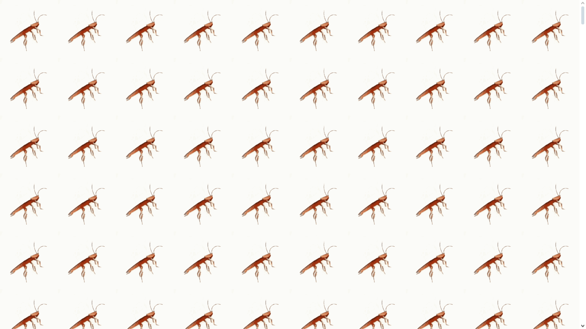

# 1000 Jumping Cockroaches 💥

Welcome to the 1000 Synchronized Jumping Cockroaches website repository! 🎉
Yes, you read that right – this is a website that features 1,000 GIFs of cockroaches jumping in perfect synchronization and neatly lined up 🪳, created upon request by my Discord friend, Carl.

## Why does this exist? 🤔
Good question! My Discord friend Carl asked me to make this, and I thought, why not? This project is all about fun, orderliness, and... synchronized cockroaches. 😎

## Features 🌟
- 1,000 GIFs of cockroaches jumping in perfect harmony and coordination.
- Neatly lined up positions for a more organized feel.
- Responsive design, so you can enjoy this synchronized spectacle on any device.

## Screenshot 📸
Here are the screenshots of the project in action:

## Live Demo

You can view the live version of the project [here](https://gianneangely.github.io/cockroaches-jumping/).

## Contributing 🛠️
Feel free to open issues or submit pull requests if you have any creative suggestions on how to make the cockroach experience even more intense!

## Disclaimer ⚠️
This project contains a lot of cockroaches (not real ones, thankfully). If you're squeamish or just hate bugs, proceed with caution!
